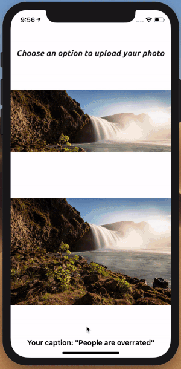

# instaCaption

This application was built to help users assign a photo caption based on the number of faces detected in a photo. Photos can be uploaded from the internet via a working URL or from the users photo library in his or her iPhone. (Scroll to bottom for preview)
 
 
 
 
| Launch Screen | Home Screen   | Upload a picture |
| ------------- | ------------- | -------------|
|   |    |  |

| Location Services | Using URL upload   | Using Camera Roll upload |
| ------------- | ------------- | -------------|
|   |    |  |

| generateDidPressed (4 faces) | generateDidPressed (0 faces)  | Saved Captions (Core Data) |
| ------------- | ------------- | -------------|
|  |    |    |

